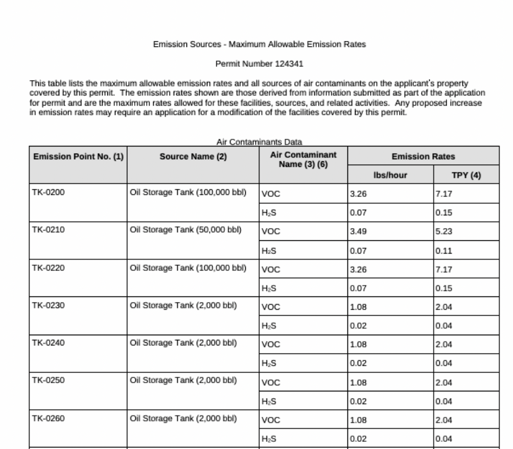
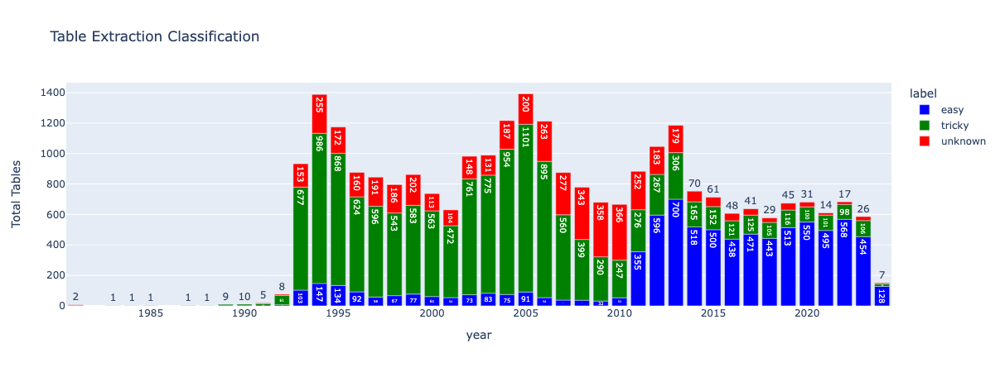

# Texas Air Permits: Extracting Maximum Allowable Emissions Rate Tables

This repository provides a tool to download Air New Source Permits from the Texas Commission on Environmental Quality (TCEQ) by inputting zip codes. It automatically extracts maximum allowable emissions rate tables (MAERTs) from the downloaded permits and saves them as CSV files.

For general documentation, read this [FAQ](https://docs.google.com/document/d/1dJIYn_4FDi1xqVX2ouW0tIdX0m9RxJCeMvTg_j1kJ8w/edit?usp=sharing). For technical details, read below.

## Overview

### What are Maximum Allowable Emissions Rate Tables (MAERTS)?

Maximum Allowable Emissions Rate Tables (MAERTs) are a key component of air permits issued by the Texas Commission on Environmental Quality (TCEQ). Any business or entity involved in activities—such as manufacturing, fuel combustion, construction, or other operations—that may impact air quality must obtain an air permit from the TCEQ.

Per air permit application, the TCEQ evaluates potential emissions and sets maximum allowable emissions for pollutants. The result is a MAERT. The limits in these tables ensure compliance with air quality standards under the Texas Clean Air Act and federal regulations. Non-compliance with the maximum allowable emissions set by the TCEQ can result in fines, penalties, or shutdowns.

### What is the process behind extracting MAERTs from Texas air permits?

The TCEQ stores air permit PDFs in an online database that requires specific filters to retrieve results. It’s useful for finding individual documents by address, Regulated Entity Name (organization or individual filing for permits), or RN (an 11-digit unique ID for facility locations). However, it is not ideal for mass downloading of files by category. 

Our process is as follows:

1. Accept a user-inputted zip code to query the Texas Commission on Environmental Quality (TCEQ) database for relevant Air New Source Permits.

2. Download the corresponding permit documents (typically PDFs) directly from the TCEQ portal.

3. Extract the Maximum Allowable Emissions Rate Tables (MAERTs) from the downloaded permits and convert them into standardized, structured CSV files.

### What potential uses are there for this data? 
The data from this tool can help answer important questions about air pollution, regulation, and environmental impacts in Texas. These are a few ideas for how it might be used. If you end up working with this tool, the Data Liberation Project would love to hear from you!

**Environmental Justice & Public Health**: 
- Who is most exposed to pollution — and where?
- Map permitted emission limits alongside demographic data (like race, income, or health outcomes).
- Identify neighborhoods with especially high concentrations of permitted pollution.

**Corporate Accountability**: Who’s polluting the most and how has that changed over time?
- Rank companies or industries by total permitted emissions.
- Track changes over time for specific companies or facilities.
- Link facilities with high MAERTs to environmental violations, fines, or lawsuits.

## Data Dictionary 
 All definitions were sourced from [TCEQ’s guidance page](https://www.tceq.texas.gov/permitting/central_registry/guidance.html) (see “TCEQ Core Data Form Instructions” document). 

## Caveats and Limitations

MAERTs across air permit PDFs lack consistent and clean formatting, which presents challenges for automated extraction. The MAERT tables fall into three categories based on formatting complexity: easy tables, tricky tables, and unknown tables. Our scripts apply different parsing methods tailored to each category.

The “easy” tables correspond to friendlier PDF formats that began appearing in 1992 and became more common starting in the early 2010s, although they do not yet represent all MAERTs.

Running the script results in the downloading of multiple CSV files—one or more per permit—containing the extracted MAERT data. Due to variability and inconsistencies in the source PDFs, these CSVs should still be visually inspected and manually edited as needed to ensure data quality.

Despite these challenges, the extraction strategies have been generally successful across a wide range of reports.

## Contributors
- Victoria Labmayr (@vickitran)
- Kat de Jesus Chua (@kat-djc)

## Licensing
This repository's code is available under the [MIT License terms](https://opensource.org/license/mit). The raw data files (in data/fetched) and PDFs are public domain. All other data files are available under Creative Commons' [CC BY-SA 4.0 license terms](https://creativecommons.org/licenses/by-sa/4.0/).

## Questions?
File an issue in this repository. 
